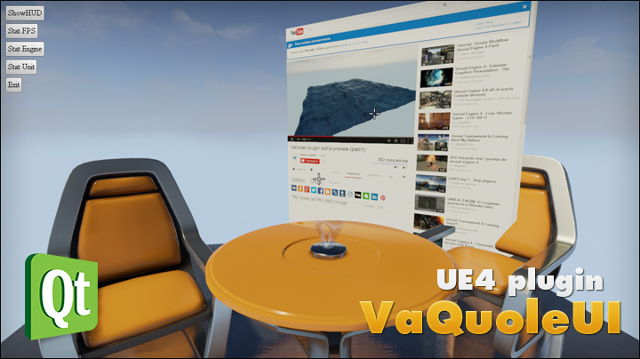

Overview
========

**VaQuoleUI** is the Web UI framework plugin for [Unreal Engine 4](https://www.unrealengine.com/) proudly based on [Qt SDK](http://qt-project.org/).

With the VaQuoleUI plugin you can create interactive User Interfaces for your game using powerful pipeline of **HTML5, CSS and JavaScript** web UI creation.

Plugin is completely **free** and available under [MIT open-source license](LICENSE).

Check the [Wiki](https://github.com/ufna/VaQuoleUI/wiki) tab to know more about the VaQuoleUI.

Current version: **1.0 Beta 8**

Legal info
----------

Unreal® is a trademark or registered trademark of Epic Games, Inc. in the United States of America and elsewhere. Unreal® Engine, Copyright 1998 – 2014, Epic Games, Inc. All rights reserved.

